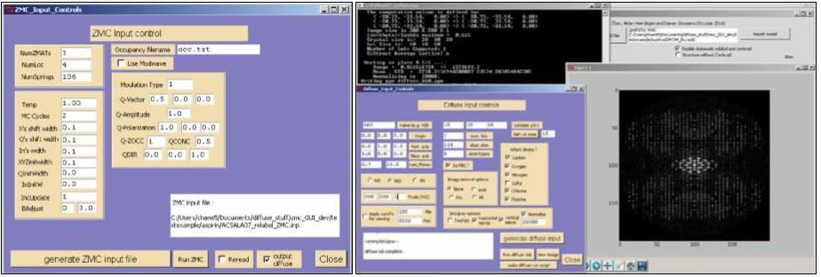

# ZMCGUI
ZMCGUI v1.0 is the prototype of a graphical user interface for the ZMC Fortran codes which performs a 
Gaussian Network Monte Carlo simulation (GNMC) of a molecular crystal. 

Author: Eric J. Chan 
Date: September 2015 (this fork uploaded May-29-2023) 

### Note: Both ZMC and ZMCGUI are legacy codes and only tested with older systems whcih predate the year 2015.
#### This distro is a fork from the version on my old 2010 macbook pro and runs perfectly fine on that machine.
It has not been tested on recent platforms.  

#### If your interested in keeping the project alive don't hesitate to connect with me.

I wrote the GUI so I could quickly load up molecular crystal structure models into the
Monte Carlo atomistic simulation program and then perform rapid calculations of diffuse X-ray intensites.
This was as alternative to alot of manual editing, and it tries to generalize and automate the process of 
building the input files for ZMC and DZMC which was tedious each time the molecule changes. 
The hope was that it would also encorage newcommers to the world of diffuse X-ray scattering for molecular crystals.
    
ZMCGUI was a python 2.7 application. In the current state ZMCGUI is not stand alone and requires dependancies. 
  
In order to run ZMC gui you will need to have a working version of python 2.7
with openbabel python bindings correctly installed.

### https://www.python.org/download/releases/2.7/

### http://openbabel.org/wiki/Main_Page

you will also need to install the program mercury (the features in the free version are all that is required)

### http://www.ccdc.cam.ac.uk/solutions/csd-system/components/mercury/

this program facilitates creating the .mol2 file which is needed for input
(we provide examples of these in the ./example_structures/ directory)
is a really great tool for working and visuallization of molecular crystals. 

in addition to python you will also need some other common libraries
i.e. numpy, tkinter 

other than this the ZMCGUI set of tools is reasonably self contained.

for more details on how to use please see the attached manual  

manual_ZMCGUIv1.pdf

 

